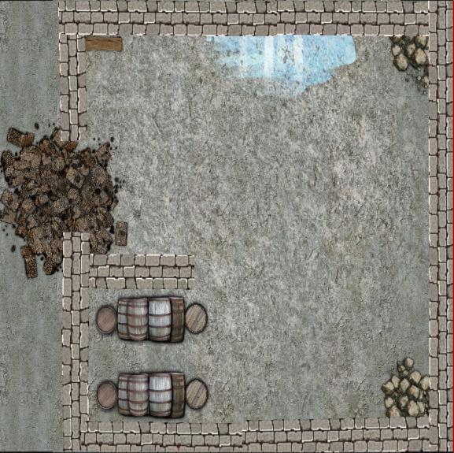

# LA maison de Rhaser Dadar
La porte de la demeure de Rhaser Dadar est fermée. Un sceau est apposé à cheval sur le montant et la porte, permettant de vérifier si la porte a été ouverte.

Une simple observation permettra de détermine que celui-ci n'a jamais été brisé.

Une mise en garde est visible sur la porte. Elle précise :
<div class='descriptive'>
Le Baron a commandité une enquête pour élucider le meurtre du contremaitre. Quiconque brisera le sceau s'expose à l'emprisonnement à vie.
</div>

> Un sort de détection de la magie permettra de voir qu'une alarme est accroché à la porte. L'ouverture de celle-ci la déclencherait.

Bien qu'un bon nombre de personne en ville ne savent pas lire, le sceau du baron est un bon indice à toutes personnes qui passe à côté et qui aurait l'idée de vouloir se servir.

Les aventuriers sont donc fortement encouragés à rechercher une autre entrée.

La maison est en angle et possède deux étages visible. L'une des fenêtres du premier étage est entre-ouverte. Toutes les fenêtres du rez-de-chaussée sont fermées.

> Les aventuriers sont donc invités à hisser l'un d'eux au second étage. La distance entre le sol et la fenêtre est de 2m80. Une échelle peut être utilisée aussi bien que l'entraide. Si l'entraide est privilégiée, un jet d'acrobatie **DD10** (car il est aidé) afin de déterminer si la personne portée arrive à grimper.

```
```

## Le premier étage


Si les aventuriers entrent de nuit, la maison est dans la pénombre. Un humain ne verra pas à plus de 4mètres. Un elfe ou un nain n'aura aucun problème pour se déplacer dans la maison.

De jour, les difficulté de déplacement n'existe plus.

L'étage est une pièce unique. L'entré se fait via la fenêtre au nord. L'aventurier qui entre est donc directement confronté à :

-   Une table de chevet surmontée d'un lampe
-   Un bureau

Sur le bureau, sont disposés des papiers. Si l'aventurier sait lire, il pourra y trouver des courbes donnant la quantité de minerais extrait sur trois semaines, ainsi les candaces des mineurs et leurs planning. La dernière date correspond à celle de sa mort.

Dans l'âtre, les restes d'un vieux feu. Un tas de bois se situe à côté de la cheminée.

A côté du lit, l'aventurier pourra distinguer au sol (**DD10** en perception) un tache de sang. La tâche est sèche, et a été& nettoyé il y a plusieurs jours (un jet de survie **DD10** permettra à l'aventurier de savoir si la blessure occasionné était grave ou non).

Devant le lit, l'aventurier trouvera un coffre contenant :

-   Des livres de compte
-   Des courbe remontant à plusieurs années
-   Des lettres officielles venant du Barron le félicitant
-   Une lettre de menace (indice : [Lettre de menace](../../3-Indices/LettreMenace.md))

Une commode contenant des habits sans valeur. L'aventurier trouvera à côté de l'escalier deux caisses, celles-ci contiennent du matériel de mineur (pioche, pelle, bougie, corde) En trouvant cela, l'aventurier pourra utiliser une corde pour que ses compagnons puissent se hisser.

\page

L'escalier mène au rez-de-chaussée.

## Le rez-de-chaussée


Le rez-de-chaussée est clairement la pièce à vivre de la maison. Une table prend la place centrale, des reste de nourriture y sont d'ailleurs présent. Un buffet ou est rangé la vaisselle est présent. Une table ou sont disposé des panier de fruits (pourri) ainsi que quelques légumes (pourri) est disposé coté rue.

L'aventurier descendant l'escalier longera un mur sur sa gauche lui permettant de voir la pièce dans son ensemble.

L'une des fenêtre est plus accessible que les autres, celle au nord ouest. L'aventurier pourra l'ouvrir en réalisant un jet de force à **DD5**. Pour accéder aux autres fenêtres il faudra bouger les meubles, (jet de force **DD20**).

Les aventuriers qui fouilleront les lieux pourront détecter la trappe menant au sous sol si le jet d'investigation dépasse le **DD20**.

Cette trappe est lourde, de toute évidence, Rhaser n'allait pas dans son sous sol régulièrement.

L'ouverture de la trappe se fera via un jet de force **DD10**.

```
```

## Le sous-sol



Le sous-sol de la maison est une cave classique. La proximité de la Sinueuse (jet de nature **DD10** permettra de savoir que c'est la rivière qui passe sous Everton) a provoqué une infiltration le long du mur nord.

Les personnages ne pouvant pas voir dans le noir total devront allumer la lumière !

Dans sa cave, Rhaser y a entreposé :

-   Sa viande dans des tonneaux contenant du sel
-   Son vin et sa bière dans des futs. Un connaisseur reconnaitra qui ce vin et cette bière ne sont pas des grand cru.

La vérification des murs permettra de définir qu'un rebouchage a été fait (jet d'intelligence **DD10**). Ce rebouchage est encore frais.

Détruire le mur les mènera dans les égouts (cf. [La cité naine](La%20cit%C3%A9%20naine.md)).