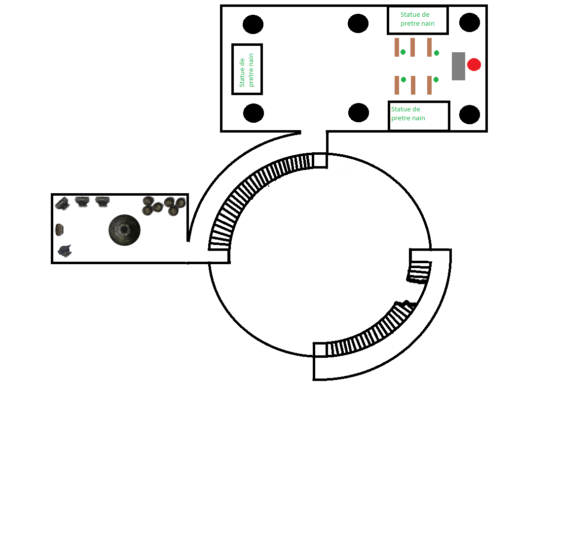

# Les égouts

On appelle cet endroit égout, mais ils n'ont rien des évacuations d'eaux usées présente dans les grandes ville. Puisqu'Everton est une petite cité, ces égouts_ sont justes des évacuation d'eau de pluie et permettent aux rues de rester sèche. Cependant, ce réseau de tunnel aménagé est assez grand pour qu'un nain puisse tenir debout. Toute personne de plus de 1m50 se tiendra courbé dans ces tunnels.

En sortie de la maison de Rhaser Dadar, le boyau s'étend sur 20 mètres à la gauche (menant à un cul de sac) et sur 6 mètres à la droite. Au bout de ces 6m, le boyau s'élargit. Il devient rectangulaire et haut de plafond.

Les aventuriers sont en surplomb de ce boyau. L'architecture change aussi.

> #### Jet de compétence
> ___
> - **compétence:** Histoire
> - **valeure:** 20
> ___
> - ***succès***: l'architecture est naine ! Et elle ne date pas d'hier. Il s'agit d'un aqueduc nain, l'architecture remonte à un millénaire !
> - ***échec***: l'architecture est naine ! Et elle ne date pas d'hier.

A gauche, les aventuriers peuvent distinguer la lumière du jour. Sur la droite, l'aqueduc s'enfonce sous la ville.

> #### Jet de caractéristique
> ___
> - **compétence:** Intelligence
> - **valeure:** 10
> ___
> - ***succès***: l'eau qui coule au fond n'est autre que celle de la Sinueuse, la rivière qui passe sous Everton.
> - ***échec***: de l'eau! de l'eau!

Sur la gauche, l'aqueduc est clos par d'épais barreau métallique empêchant le passage.

Sur la droite, l'aqueduc continue s'enfonçant progressivement sous la ville.

Des passerelle régulière (~tous les 10 mètres) permettent le passage d'une rive à l'autre.

Une légère pente descendante se fait sentir et les puits de lumière provenant de la rue se font moins régulier jusqu'à disparaitre.

Les aventurier avançant dans le noir distingueront une ouverture sur leur gauche donnant sur une pièce. L'ouverture en question a été creusée. Les pierres sont éparpillées à la fois dans la pièce et dans l'aqueduc.

# La cité naine

Les aventuriers mettent les pieds dans une maison qui a plus de mille ans. La pierre est toujours debout, mais les meubles se sont effrités avec le temps. La pièce dans laquelle les aventurier se trouve représente donne un premier aperçu du savoir-faire ancien des Nains. La pièce est haute de plafond, environ 5m de haut.

Les nains du groupe auront un sentiment de bienêtre, voire de plénitude.  Le lieux n'est pas béni pour un Dieu du panthéon nain en particulier mais le fait de se retrouver dans une architecture familière leur provoquera un sentiment de bonheur.

-   [Constitution] (**DD25**) : passez ce jet signifie que le nain ne pleure pas.
-   [Constitution] (**DD20**) : le nain pleure mais garde sa stature. Il l'assure, il ne pleure pas, ce doit être la poussière.
-   [Constitution] (**DD10**) : le nain s'assoie sur un banc présent dans la pièce et pleure à chaude larme. Ce sont des larmes de bonheur.

La pièce est constituée d'un banc, d’une table en pierre. Les reste d'un âtre sont visible dans un coin de la pièce. De la couche seul le socle en pierre est encore présent.

\page

> #### Jet de compétence
> ___
> - **compétence:** Investigation
> - **valeure:** 18
> ___
> - ***succès***: sous le lit, une pierre se détache révélant les restes de vieux parchemins ainsi qu'un anneau.
> - ***échec***: c'est vieux, c'est sale, je ne met pas mes doigts la dessous!

- *Identification* : L'anneau est un anneau de protection +1. Cet anneau renforce l'armure du porteur et octroie un +1 CA. 
Lien: repos court requis

Lorsque les aventuriers quitteront cette pièce, ils entreront dans une salle circulaire, le sol est pavé de ces pierres que seule les nains savent faire (grosse, massive). Sur le contour, des maisons naines, en face, une sorte de temple, ou un palais. Au centre, un puit dont on ne peut distinguer le fond.

> #### Jet de compétence
> ___
> - **compétence:** Histoire
> - **valeure:** 20
> - **special** Connaissance de la pierre : succes automatique
> ___
> - ***succès***: le monument qui se dresse devant eux est un ancien temple. Les sculptures sont à l'effigie de Moradin. On retrouve un nain glorieux maniant un marteau devant une enclume.
> - ***échec***: Belle scuplture!

Sur le sol de la place, des roches et rocher sont éparpillés, certains de ces rocher offre un couverture suffisante en cas d'attaque. Au plafond, un matière reflétant la lumière permet un rayonnement suffisant d'une torche pour éclairer l'ensemble de la place. Les pas de porte et les bord de fenêtres des demeures sont dans la pénombre.

> #### Jet de compétence
> ___
> - **compétence:** Perception
> - **valeure:** 20
> - **special** nyctalope : succes automatique
> ___
> - ***succès***: un arbalétrier est caché dans une des maisons
> - ***échec***: c'est calme!

\page 

___
> ## Bandit
>*Humanoïde (toute race) de taille M, tout alignement non loyal*
> ___
> - **Classe d'armure** 12 (armure de cuir)
> - **Points de vie** 11 (2d8 + 2)
> - **Vitesse** 9 m
>___
>|FOR|DEX|CON|INT|SAG|CHA|
>|:---:|:---:|:---:|:---:|:---:|:---:|
>|11 (+0)|12 (+1)|12 (+1)|10 (+0)|10 (+0)|10 (+0)|
>___
> - **Sens** Perception passive 10
> - **Langues** une langue au choix (généralement le commun)
> - **Puissance** 1/8 (25 PX)
> ___
> ### Actions
> **Cimeterre.** *Attaque au corps à corps avec une arme* : +3 au toucher, allonge 1,50 m, une cible. *Touché* : 4 (1d6 + 1) dégâts tranchants.
> 
> **Arbalète légère.** *Attaque à distance avec une arme* : +3 au toucher, portée 24/96 m, une cible. *Touché* : 5 (1d8 + 1) dégâts perforants.  
> 1 Fléchette empoisonnée - Poison Drow (**DD13**) perte de connaissance sur 1 minute.

L'Homme possède une amulette avec un crâne et une faucille (le symbole de Nerull). Elle n'est pas magique.

La porte du temple est fermée par une lourde double-porte en pierre, il est impossible de la bouger. Les autres maison sont vides.

Le puit central est aménagé avec deux escaliers qui descendent dans les profondeurs du puit. Les escaliers sont situés au nord et sud du puit. Ils finissent respectivement à l'Ouest et Est.

L'escalier Sud fini brutalement, quiconque ne fera pas attention prendra 1d6 de dégât de chute (un jet d'acrobatie **DD10** pourra être fait pour diviser les dégâts par 2). La chute peut être évitée si les aventuriers ont éclairé leur chemin ou si l'un des aventuriers est nyctalope.

L'escalier Nord mène à un couloir circulaire. Ce couloir est éclairé par des torches dont émanent une lueur verdâtre.

### La forge

Il s'agit d'une petite forge. En son centre on peut encore apercevoir le four. Sur la droite de l'entrée, des barils cassés laissant apercevoir des restes de charbon et d'autres éléments (**DD20** on trouvera du plomb, **DD25** de l'obsidienne).  
Derrière le four, on peut voir des armures rouillées entreposée sur des mannequins branlants (si un personnage touche une armure, le mannequin d'effrite et se brise faisant tomber l'armure dans un fracas qui retenti dans toute la ruine.  
Les aventuriers trouveront aussi une vieille enclume. Et entre l'enclume et les mannequins d'armure un coffre.

Dans le coffre, on trouvera une paire de bracelets d'armure (+1), octroyant +1 à la CA à quiconque les portes. Le porteur aura un champ de force autour de lui (ce champ de force est tangible).

Le couloir mène à une porte de bois. Plus les aventuriers s'en approche, plus ils s’en approchent plus ils peuvent entendre des murmures comme des incantations.

\page

### Le temple

L'entrée de la salle est fermée par une porte. Celle-ci n'est pas fermée à clé.

- **DD10** en Discrétion pour l'ouvrir sans se faire remarquer.
- **DD16** en force pour l'enfoncer

La salle est composée de 6 piliers, massif. Ils donnent l'impression de soutenir l'étage supérieur. Sur la gauche de l'entré, une statue géante d'un nain en armure tenant un marteau se dresse fièrement pointant son regard vers le fond de la pièce.  Sur la droite, six bancs fond face à un autel. Des statue de nain en toge tenant un sceau entre leur main (**DD15 en religion** ce sont des prêtres de Moradin. Ils tiennent une représentation sculpté d'un catalyseur divin de leur ordre).

Dans le fond un personnage réalise un sermon à deux personnes encapuchonnées.
___
> ## Prêtre
> *Humanoïde (toute race) de taille M, tout alignement*
> ___
> - **Classe d'armure** 13 (chemise de mailles)
> - **Points de vie** 27 (5d8 + 5)
> - **Vitesse** 9m
> ___
> |FOR|DEX|CON|INT|SAG|CHA|
> |:--:|:--:|:--:|:--:|:--:|:--:|
> |10 (+0)|10 (+0)|12 (+1)|13 (+1)|16 (+3)|13 (+1)|
> ___
> - **Compétences** Médecine +7, Persuasion +3, Religion +5
> - **Sens** Perception passive 13
> - **Langues** deux langues au choix
> - **Puissance** 2 (450 PX)
> ___
> **Distinction divine.** Par une action bonus, un prêtre peut dépenser un emplacement de sort pour que ses attaques au corps à corps avec une arme fassent magiquement 10 (3d6) dégâts radiants supplémentaires à une cible qu'il touche. Cet avantage se poursuit jusqu'à la fin du tour. Si le prêtre dépense un emplacement de sort de niveau 2 ou plus, les dégâts supplémentaires augmentent de 1d6 pour chaque niveau au-dessus du 1er.
>
> **Incantation.** Le prêtre est un lanceur de sorts de niveau 5. Sa caractéristique d'incantation est la Sagesse (jet de sauvegarde contre ses sorts DD 13, +5 au toucher pour les attaques avec un sort). Le prêtre a préparé les sorts de clerc suivants :
>
> Sorts mineurs (à volonté) : flamme sacrée, lumière, thaumaturgie
> Niveau 1 (4 emplacements) : éclair traçant, sanctuaire, soins
> Niveau 2 (3 emplacements) : arme spirituelle, restauration partielle
> Niveau 3 (2 emplacements) : dissipation de la magie, esprits gardiens
> ### ACTIONS
> **Masse d'armes.** *Attaque au corps à corps avec une arme* : +2 au toucher, allonge 1,50 m, une cible. *Touché* : 3 (1d6) dégâts contondants.

---
**Loots**
- 1 collier avec un os en pendentif (Focaliseur divin)
- 1 tunique en lin déchirée
- 1 cape avec capuche en laine ayant une boucle de fermeture mêlant un crane et d'une faucille
- 1 armure d'écaille
- 1 baguette fate de bois d'ébène, au touché il s'en dégage un sentiment de noirceur pure.
  -  *Identification* -> [baguette de peur](https://www.aidedd.org/dnd/om.php?vf=baguette-de-peur).
---

\page
___
> ## Fanatique de Nérull
>*Si j'existe, c'est d'être fan*
> ___
> - **Classe d'armure** 12
> - **Point de vie** 9 (2d8)
> - **Vitesse** 9m.
>___
>|FOR|DEX|CON|INT|SAG|CHA|
>|:---:|:---:|:---:|:---:|:---:|:---:|
>|11 (+0)|12 (+1)|10 (+0)|10 (0)|11 (+0)|10 (+0)|
>___
> - **Compétences** Religion +2, Tromperie +2
> - **Senses** Perception passive 10
> - **Puissance** 1/8 (25 XP)
> ___
> ***Sombre dévotion.*** Le fanatique a un avantage aux jets de sauvegarde pour ne pas être charmé ou effrayé.  
> ### Actions  
> ***Cimeterre.*** *Attaque au corps à corps avec une arme* : +3 au toucher, allonge 1,50 m, une créature. *Touché* : 4 (1d6 + 1) dégâts tranchants.  
> ***Arbalette.*** *Attaque à distance* : +2 au touché, une créature. *Touché* : 6 (1d8 +2)

---
**Loots**

- 1 Cimetere stylisée : sur la garde un symbole (crane + faucille), sur la poignée des gemmes semi-précieuse.
- 1 cape avec capuche en laine

Fouille de la salle:

- L'autel est délabré, les symboles de Moradin sont à peine visibles, probablement effacé par les membre du culte (de Nérull si les PJ le savent).
- Les statues présentent un socle avec une poignée. La statue de droite renferme un câlice en pierre sculpté, sertie de pierre semi-précieuse. Sur le pourtour sont gravé des runes en langue Naine :  
  *Sans le clan point de nain, sans le fer point d'acier*.

Ce dicton se réfère à l’importance du clan, de la famille et de la communauté dans la vie d’un nain. Il enseigne que sans l’appui de son clan, le nain ne peut devenir aussi fort et aussi solide que l’acier

- Un livre dont la couverture représente le symbole de Moradin. Les pages de ce livre partent en lambeau au touché.
- La statue de gauche renferme des restes de panier en osier.
- La statue du fond est un simple trompe l'œil.

Les symboles sont l'éléments clés de la quête. Il faudra les ramener au baron DeathHammer.
