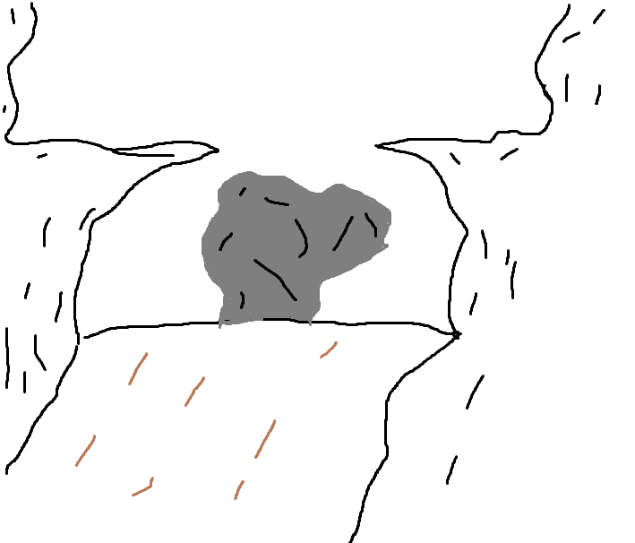
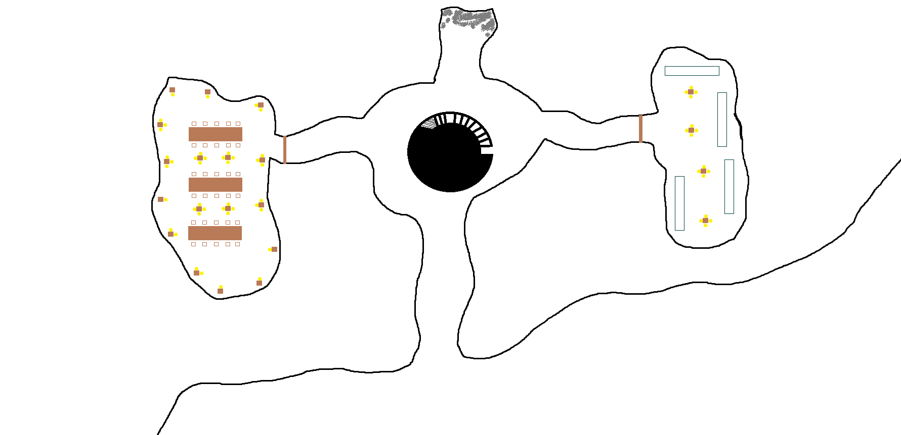
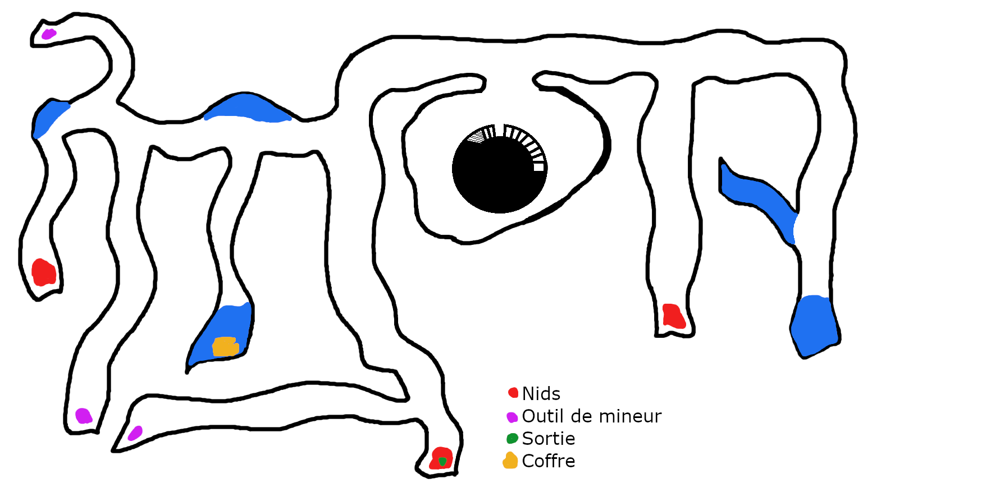
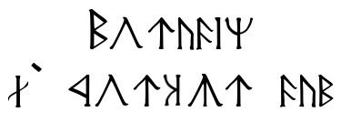

<div class='pageNumber auto'></div>

# La mine des infestés

La quête démarre lorsque les aventuriers rejoignent la caravane proposée par le Baron à la porte nord

Elle se déroules en 3 actes :  
- Embuscade par 6 fanatiques de Nerull. Un d'entre eux prendra la fuite
- Arrivée à la mine: les gardes restant montent l'avant poste
- Dans la mine, des pièges et une liche. La descente dans la mine conduira les aventurier à la cité naine et notamment au temple dont la porte était bloqué (cf [Les meurtres d'Everton](1-%20les%20meurtres%20de%20Everton.md))

pnj :
___
> ## Fanatique de Nérull
>*Si j'existe, c'est d'être fan*
> ___
> - **Classe d'armure** 12
> - **Point de vie** 9 (2d8)
> - **Vitesse** 9m.
>___
>|FOR|DEX|CON|INT|SAG|CHA|
>|:---:|:---:|:---:|:---:|:---:|:---:|
>|11 (+0)|12 (+1)|10 (+0)|10 (0)|11 (+0)|10 (+0)|
>___
> - **Compétences** Religion +2, Tromperie +2
> - **Senses** Perception passive 10
> - **Puissance** 1/8 (25 XP)
> ___
> ***Sombre dévotion.*** Le fanatique a un avantage aux jets de sauvegarde pour ne pas être charmé ou effrayé.  
> ### Actions  
> ***Cimeterre.*** *Attaque au corps à corps avec une arme* : +3 au toucher, allonge 1,50 m, une créature. *Touché* : 4 (1d6 + 1) dégâts tranchants.  
> ***Arbalette.*** *Attaque à distance* : +2 au touché, une créature. *Touché* : 6 (1d8 +2)

___
> ## Garde de la caravanne
>*Ils sont là pour...garder*
> ___
> - **Classe d'armure** 16
> - **Points de vie** 11(2d8 + 2)
> - **Vitesse** 9ft.
>___
>|FOR|DEX|CON|INT|SAG|CHA|
>|:---:|:---:|:---:|:---:|:---:|:---:|
>|13 (+1)|12 (+1)|12 (+1)|10 (+0)|11 (+0)|10 (+0)|
>___
> - **Compétences** Perception +2
> - **Senses** Perception passive 12
> - **Langues** Commun
> - **Puissance** 1/8 (25 XP)
> ___
> ### Actions
> ***Lance.*** *Attaque au corps à corps ou à distance avec une arme* : +3 au toucher, allonge 1,50 m ou portée 6/18 m, une cible. *Touché* : 4 (1d6 + 1) dégâts perforants ou 5 (1d8 + 1) dégâts perforants si utilisée à deux mains pour faire une attaque au corps à corps. 
> ***Eppée courte*** *Attaque au corps à corps avec une arme* : +2 au toucher, allonge 1,50 m, une cible. Touché : 4 (1d6 + 1) dégâts perforants 
> ***Arc court*** *Attaque à distance* : +4 au touché, une créature. *Touché* : 4 (1d6 +1)

\page 
<div class='pageNumber auto'></div>

## L'embuscade

Après une demie journée de marche, alors que la caravane avance dans une ravine et au détour d'un virage, les aventurier vont être bloqué par un gros rocher. Il sera impossible de contourner l'obstacle.

> #### Jet de caractéristique
> ___
> - **caractéristique:** Perception
> - **valeure:** 15
> ___
> - ***succès***: Des gravillons tombent des rebords. Quelque chose se prépare.
> - ***échec***: Un carreau est tiré des hauteurs et touche l'un des gardes.




Il y a 6 fanatiques, deux en hauteur à l'arbalète, 4 en bas en corps à corps.  
Le combat se termine par la fuite du dernier fanatique. Les aventurier auront le choix de suivre le fanatique ou d'aider à déblayer le rocher devant la caravane.

## L'arrivée à la mine

L'odeur est insoutenable, des mouches volent par centaines. Les cadavres des mineurs sont là à même le sol. Certains éventrés, d'autre les membres semblent avoir été arrachés. Mais tous ont le visage horrifié.

> #### Jet de Sauvegarde
> ___
> - **caractéristique:** Constitution
> - **valeure:** 15
> ___
> - ***succès***: L'aventurier réussier à retenir un haut-le-coeur.
> - ***échec***: L'aventurier vomit.

Si les aventuriers ont aidé la caravane, l'un des gardes restant se fera attaquer, 3 cadavres se relèvent.
Sinon, 3 cadavres se relèvent après leur passage ou durant leur fouille.

___
> ## Zombi de mineur
>*here comes the Thriller*
> ___
> - **Classe d'armure** 8
> - **Point de vie** 22(3d8 +9)
> - **Vitesse** 6m.
>___
>|FOR|DEX|CON|INT|SAG|CHA|
>|:---:|:---:|:---:|:---:|:---:|:---:|
>|13 (+1)|6 (-2)|16 (+3)|3 (-4)|6 (-2)|5 (-3)|
>___
> - **Jets de sauvegarde** Sagesse +0
> - **Immunités aux dégâts** poison
> - **Immunités aux états** empoisonné
> - **Sens** vision dans le noir 18 m, Perception passive 8
> - **Langues** Commun, le comprend mais ne le parle pas
> - **Puissance** 1/4 (50 XP)
> ___
> ***Tenacité de mort-vivant.*** Si des dégâts font tomber le zombi à 0 point de vie, celui-ci doit effectuer un jet de sauvegarde de Constitution DD 5 + les dégâts subis, sauf en cas de dégâts radiants ou coup critique. En cas de réussite, il tombe à 1 point de vie à la place.
> ### Actions
> ***Coup.*** *Attaque au corps à corps avec une arme* : +3 au toucher, allonge 1,50 m, une cible. *Touché* : 4 (1d6 + 1) dégâts contondants. 

---
Loots

- 5po (hey ce sont des mineurs, pas vraiment les plus riches)
---

A la fin du combat les gardes restant utiliseront le matériel de la caravane et commenceront à monter le camp.


> #### Jet de caractéristique
> ___
> - **caractéristique:** Investigation
> - **valeure:** 10
> - **spécial** Détection des pièges (succcès automatique)
> ___
> - ***succès***: Un piège a été dressé à l'entré, la fosse est vulgairement camouflée.
> - ***échec***: L'aventurier tombe dans le piège. 1d6 de dégat de chute (jet de dextérité > 15: /2 sur les dégats)

\page 

## Le premier niveau

Toutes les torche sont éteintes, même les nyctalope n'y voient rien



Le tunnel principal mène à une salle gigantesque. Au sol, un system de rail permettant l'extraction de wagonet.
*Il a fallu quelques mois déjà pour creuser cette salle!*

Une torche ou un sort de lumière ne suffit pas pour éclairer l'autre bout de la salle.  
Au centre de la salle, un immense trou où l'on distingue des escaliers et ce qui ressemble à un quai de chargement/déchargement. Un tas de corde et poulie sont disposée au plafond, certaines extrémité bloqué par des leviers qui sont au nombre de 3. Les deux premiers levier sont penché vers l'intérieur de la plateforme, le dernier vers l'extérieur.


> #### Jet de caractéristique
> ___
> - **caractéristique:** Intelligence
> - **valeure:** 13
> ___
> - ***succès***: L'assemblage est complexe. On peut cependant repérer que l'une des cordes est très usée, à la limite de la rupture.
> - ***échec***: L'assemblage est trop complex pour l'aventurier, il passe sont chemin.

*L'utilisation du levier 3, fera remonter le plateau mais la corde lâchera en cours de route faisant tomber le plateau qui se fracassera au sol.*

La salle est un croisement.

### A l'ouest

A l'ouest les restes d'une salle de repas.  
3 tables et 30 sièges sont disposés.  
Les madriers contiennent des torchères qui sont toutes éteintes.  
Des cadavres sont au sol, d'autre adossé au mur et certains encore à leur place à table.  
A l'une des tables, est penché une forme humanoïde qui semble manger bruyamment.  

<div class='descriptive'>
C'est une goule, les goules parlent. Les entendants, elle leur répondra </br>
Manger!
</br>
et continuera de manger le cadavre devant-elle jusqu'à ce que les aventuriers n'approche que trop près.
</div>

___
> ## Goule
>*Quoi ma goule!*
> ___
> - **Classe d'armure** 12
> - **Point de vie** 22(5d8)
> - **Vitesse** 9m.
>___
>|FOR|DEX|CON|INT|SAG|CHA|
>|:---:|:---:|:---:|:---:|:---:|:---:|
>|13 (+1)|15 (+2)|10 (+0)|7 (-2)|10 (+0)|6 (-2)|
>___
> - **Immunités aux dégâts** poison
> - **Immunités aux états** empoisonné, charmé, épuisement
> - **Sens** vision dans le noir 18 m, Perception passive 10
> - **Langues** Commun
> - **Puissance** 1 (200 XP)
> ___
> ### Actions
> ***Griffes.*** *Attaque au corps à corps avec une arme* : +4 au toucher, allonge 1,50 m, une cible. *Touché* : 7 (2d4 + 2) dégâts tranchants. Si la cible est une créature autre qu'un elfe ou un mort-vivant, celle-ci doit réussir un jet de sauvegarde de Constitution DD 10 pour ne pas être paralysée pendant 1 minute. La cible peut relancer le jet de sauvegarde à la fin de chacun de ses tours, mettant fin à l'effet qui l'affecte en cas de réussite.
>
> ***Morsure***. *Attaque au corps à corps avec une arme* : +2 au toucher, allonge 1,50 m, une créature. *Touché* : 9 (2d6 + 2) dégâts perforants.


### A l'Est

La porte est fermée à clé.
> #### Jet de caractéristique
> ___
> - **caractéristique:** Escamotage
> - **valeure:** 15
> - **spécial** Requiert des outils de voleur
> ___
> - ***succès***: L'aventurier réussit à crocheter.
> - ***échec***: L'aventurier abandonne, ce n'est pas son jour.

> #### Jet de caractéristique
> ___
> - **caractéristique:** Force
> - **valeure:** 18
> ___
> - ***succès***: L'aventurier brise la porte.
> - ***échec***: L'aventurier abandonne, ce n'est pas son jour.

\page

*Inutile de rappeler que la pièce est dans le noir.*

> #### Jet de caractéristique
> ___
> - **caractéristique:** Perception
> - **valeure:** 16
> ___
> - ***succès***: Des mouvements se font entendre, une goule saute de casier en casier.
> - ***échec***: Juste des bruits. Rien d'étonnant, la pièce est humide, les aventuriers réchauffent l'atmosphère.

<div class='descriptive'>
Si la goule est détectée, le combat peut commencer. La goule est alors sur un des casiers, et les regarde.
</div>

Derrière la porte, la pièce ressemble à un vestiaire. Des casiers sont alignés sur deux profondeurs.

Le sol est recouvert de sang, trois corps sont adossés aux casiers, un corps est allongé au sol.

Le corps au sol porte des habits différents de ceux des autres personnes:

-   Une armure de cuir
-   Un broche encore agrafée

<div class='descriptive'>
Si la goule n'est pas détectée, le combat débutera avec le réveille du contremaitre. Lorsque quelqu'un touchera sa broche, le cadavre tentera de mordre sa cible. La goule attaquera par derrière
</div>

___
> ## Zombi de mineur
>*here comes the Thriller*
> ___
> - **Classe d'armure** 8
> - **Point de vie** 22(3d8 +9)
> - **Vitesse** 6m.
>___
>|FOR|DEX|CON|INT|SAG|CHA|
>|:---:|:---:|:---:|:---:|:---:|:---:|
>|13 (+1)|6 (-2)|16 (+3)|3 (-4)|6 (-2)|5 (-3)|
>___
> - **Jets de sauvegarde** Sagesse +0
> - **Immunités aux dégâts** poison
> - **Immunités aux états** empoisonné
> - **Sens** vision dans le noir 18 m, Perception passive 8
> - **Langues** Commun, le comprend mais ne le parle pas
> - **Puissance** 1/4 (50 XP)
> ___
> ***Tenacité de mort-vivant.*** Si des dégâts font tomber le zombi à 0 point de vie, celui-ci doit effectuer un jet de sauvegarde de Constitution DD 5 + les dégâts subis, sauf en cas de dégâts radiants ou coup critique. En cas de réussite, il tombe à 1 point de vie à la place.
> ### Actions
> ***Coup.*** *Attaque au corps à corps avec une arme* : +3 au toucher, allonge 1,50 m, une cible. *Touché* : 4 (1d6 + 1) dégâts contondants. 

\page 

___
> ## Goule
>*Quoi ma goule!*
> ___
> - **Classe d'armure** 12
> - **Point de vie** 22(5d8)
> - **Vitesse** 9m.
>___
>|FOR|DEX|CON|INT|SAG|CHA|
>|:---:|:---:|:---:|:---:|:---:|:---:|
>|13 (+1)|15 (+2)|10 (+0)|7 (-2)|10 (+0)|6 (-2)|
>___
> - **Immunités aux dégâts** poison
> - **Immunités aux états** empoisonné, charmé, épuisement
> - **Sens** vision dans le noir 18 m, Perception passive 10
> - **Langues** Commun
> - **Puissance** 1 (200 XP)
> ___
> ### Actions
> ***Griffes.*** *Attaque au corps à corps avec une arme* : +4 au toucher, allonge 1,50 m, une cible. *Touché* : 7 (2d4 + 2) dégâts tranchants. Si la cible est une créature autre qu'un elfe ou un mort-vivant, celle-ci doit réussir un jet de sauvegarde de Constitution DD 10 pour ne pas être paralysée pendant 1 minute. La cible peut relancer le jet de sauvegarde à la fin de chacun de ses tours, mettant fin à l'effet qui l'affecte en cas de réussite.  
> ***Morsure***. *Attaque au corps à corps avec une arme* : +2 au toucher, allonge 1,50 m, une créature. *Touché* : 9 (2d6 + 2) dégâts perforants.


### Au Nord

Rien le tunnel est effondré

## Second niveau

- 2 Cultistes : ils remontent depuis la sortie du niveau.  
- 4 zombies : deux par nids excepté celui sur la sortie qui reste vide. 
- 1 goule : présente dans le nid à droite. 



```
```

## Troisième niveau


Rencontre:

-   1 liche naine (cf [Liche Bzakhudyk](../1-Everton/2-Personnages/Bramnyl_Bzakhudyk.md)) + invocation 6 squelettes
-   2 cultistes

Les aventuriers arrivent dans ce niveau par une échelle menant dans une alcôve du couloir principale du troisième niveau.  
Sur leur gauche, le couloir mènera au trou principale. Le plateau de transport se trouve écrasé à leur pieds.  
Sur leur droite, le couloir se prolonge.  
Après 50m, le tunnel laisse entrevoir un trou dans un mur de pierre.

> #### Jet de compétence
> ___
> - **compétence:** Histoire
> - **valeure:** 10
> - **spécial:** connaissance de la pierre (Nain)
> ___
> - ***succès***: cette pierre est façonnée de la même manière que celle trouvée sous Everton.
> - ***échec***: des pierres taillées. C'est bien fait!


Après ce trou, les aventurier entrent dans ce qui ressemble à un hall immense, on ne distingue pas le plafond mais on peut deviner que celui-ci doit bien s'étendre sur les trois étages de la mine. Un succession de colonne richement décorée de sculpture naine se dresse devant eux.

Entre les deux colonnades, on devine les restes de ce qui fut un tapis. Sur chaque colonne sont disposé des torchères sans torche.

Sur les murs, on distingue des fresques sculptées.

\page

Au dessus, de la première l'inscription suivante:


Tr-> Moradin, le forgeur d'âme

La seconde représente un nain chassé par les siens, qui revint sous la forme d'une liche.

Au dessus est inscrit:


Tr -> Bramnyl le bannis

<div class='descriptive'>
    L'aventurier qui connait la légende de Bramnyl peut ainsi la raconter à ses compagnons.
</div>

Après cette histoire, les aventuriers entendront parler dans le fond de la pièce. Des voix se rapprochent ainsi que le cliquetis caractéristique des squelettes.

Deux cultistes et 3 squelettes feront leur entrée dans le hall, faisant route vers le trou par lequel les aventuriers sont arrivés.

> #### Jet de compétence
> ___
> - **compétence:** Perception
> - **valeure:** 10
> ___
> - ***succès***: des bruits de pas se font entendre.
> - ***échec***: les aventuriers ne remarque pas les cultistes et les squelettes qui viennent de la salle du fond.

A eux de décider s'ils attaquent ou s'ils laissent passer les pnj.

### La pièce de la liche

Il s'agit de l'ancienne salle de prière. Au centre on distingue les reste d'un puit. De part et d'autre des bancs en pierre. De l'autre coté, un autel ou une masse filiforme portant des vêtements en lambeau flotte le dos tourné aux aventuriers.

La liche se rapprochent des aventuriers qui restent immobile, saisis par un sort d'immobilisation.  
- Je vous attendais. Surtout toi Ulrik Fortenclume. Ta famille m'a été bien utile et ton sacrifice ne sera pas vain! Nerull sait récompenser les âme qui lui sont dévouée!

La liche soulèvera alors l'un des aventurier par télékinésie et lui brise la nuque. Il tombera ainsi inerte au sol, à 0pv.  
La liche se tourne ensuite vers un second aventurier:
- Je saurais faire de toi quelque chose d'utile
  
Enfin la Liche se dirige vers un troisième aventurier. Elle passe une main le long de la joue du mage dévoilant ainsi toute illusion existante.  
- Ton frère sait se montrer d'une utilité à toute épreuve, j'espère que tu en feras autant. 

La liche quitte alors la pièce et disparait dans un nuage de fumée. 

---
**Loot:**
- **Baguette**: morceau de bois sombre tailler en griffe à une extrémité.  
  **Malédiction de la chair** : perd 6 de constitution immédiatement, toutes les heures des pustules de nécrose apparaissent sur la cible, si non soignée dans les 24h transforme la cible en [charognard rampant](https://www.aidedd.org/dnd/monstres.php?vf=charognard-rampant).
- 300 po
- 5 perle noire + 1 diamant + 8 agates
- Un livre, [Le journal de Bramnyl](../3-Indices/Le%20journal%20de%20Bramnyl.md)
- 1 parchemin d'alarme
- 1 parchemin d'animation des morts

---
