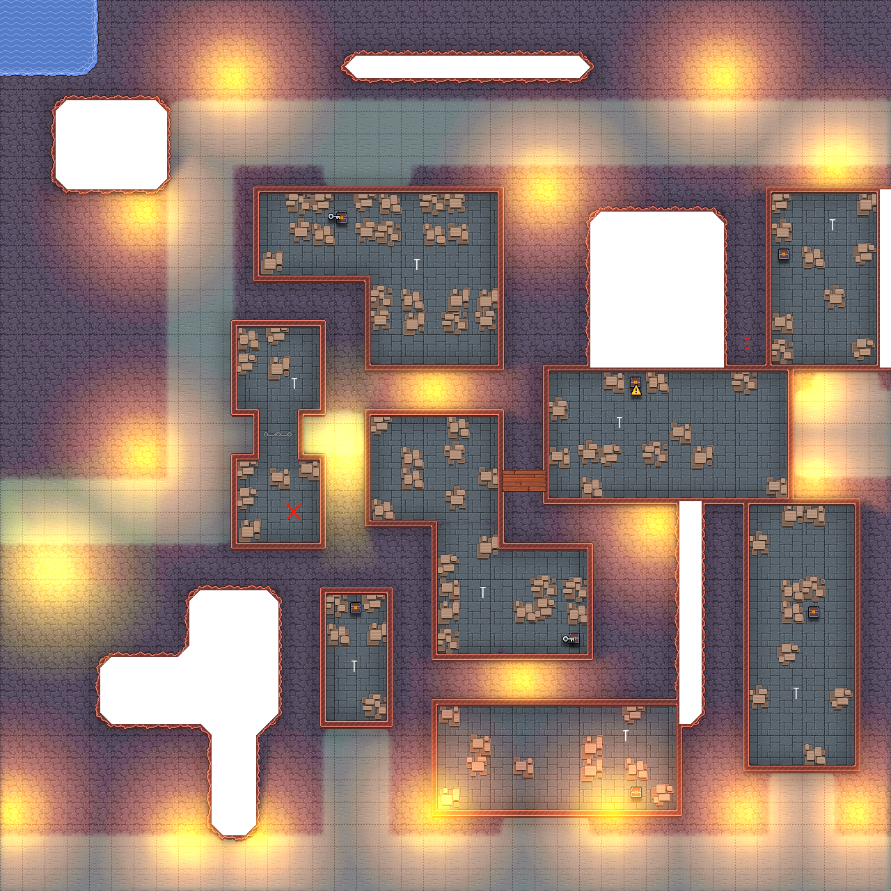

# Le chat perdu de la mère Ritchell

La quêtes se déroulera dans l'enceintte de la ville. En s'approchant de l'habitation de Mme Ritchell,
les aventuriers croiseront des affichettes rappelant l'annonce trouvée sur le panneau.    
Mme Ritchell est une vieille dame (humaine) proche des 70 ans. Dans d'autre circonstance elle serait 
une doyenne de tribu et par conséquent très respecttée. Ici, elle est juste une vieille dame.  

## La maison des chats

Mme Ritchell vit dans une demeure des plus modestes. Une seule pièce sert de cuisine, chambre 
et latrine. Elle vit avec ses six chats:  
- Malo, un noir et blanc  
- Teigne, une chatte rousse. Elle feulera à chaque fois que quelqu'un essaira de l'approcher.  
- Pelle, une chatte blanche. Elle restera assise à observé les aventuriers.  
- Terton, un gros chat gris. Il ne quitera jamais sa maitresse, toujours soit assis sur elle, 
soit dans ses pieds  
- Lumo, un chat roux avec ses pattes blanches. Il aime le feu et restera proche de la cheminé.  
- Pitre, un chat noir. Il aime virevolter sur les meubles et jouer avec tout ce qu'il trouve.  

Le chat manquant à l'appel est Pitre. Ce dernier a profité que la fenêtre soit ouverte pour s'enfuire.  
Cela fait trois semaines que Mme Ritchel a perdu son chat. Elle a collé des affichettes partout dans 
le quatier.  

Son petit Pitre lui manque, lui toujours prêt à la faire rire. Elle n'a pas grand chose a offrir mais 
elle saura aider les aventuriers. 

## La recherche de l'animal
La recherche dans le voisinage ne mènera rien, les gens vivant dans ce quartier ne s'occupe pas des 
affaires des autres même lorsqu'il s'agit de celles de la vieille Ritchell.  
Le chat ne peut pourtant pas être très loins. 
[jet de survie - 10] avec avantage si le personnage connait les chat (cf background) : des crotes de 
chats peuvent être vu au fond d'une ruelle.  
Dans cette ruelle, les aventuriers pourront entendre des miaulements.
[jet de investigation - 20] la ruelle faisant echo, il est compliqué aux aventuriers de discerné d'où 
vienne les miaulements exactement. Cependant, s'ils réussissent, ils se rendront compte qu'ils proviennent 
d'au dessus d'eux. De plus il n'y a pas qu'un unique miaulement.

Il faudra donc que les aventuriers trouvent un moyen pour grimper.

### Le voisinage

Si les aventurier décident de demander au voisinage, ils devront convaincre les habitant qu'il leur est 
necessaire d'accéder au toit de leur maison. Ils ont donc le choix entre la persuasion et l'intimidation:
[jet de persuasion]
- 15: la personne acceptera de les aider et les laissera entrer dans la maison.
--> si Fumble, la personne criera à la garde et dira à la milice que les aventuriers sont là pour essayer 
de le voler puisqu'il demande à entre chez elle.

[jet d'intimidation]
- 10: la personne laissera entrer les aventuriers de peur. Attendra que ceux-ci soient occupé à leur affaire 
pour appeler la milice.

:warning: si la [milice](###la-milice) est appelée, un combat commencera si les aventuriers ne réussisent pas 
à convaicre les gardes de leurs intentions. 

### un moyen non conventionnel
Deux possibilités s'offrent aux aventuriers:
- Utiliser [une corde](####une-corde-qu-on-se-pende) et escalader
- Trouver un endroit permettant de grimper [simplement](####une-échelle-c-estt-plus-simple).

#### Une corde qu'on se pende
Si les aventuriers decident d'utiliser une cordre pour grimper, il leur faudra faire attention à ne pas 
eveiller les soupçons. Certe ils sont dans une ruelle, mais des personne de la milice de quartier patrouille, 
sans compter que les maisons sont habitées.

[jet de dextérité : 25] Il faudra une grande dextérité pour accrocher une flèche sur les toits.

[jet de Discrétion]
- 10: la milice ne sera pas alerté par les agissements directes des aventuriers
- 15: les personnes vivants dans les maisons ne sauront même pas que les aventuriers sont là.

:warning: si la [milice](#la-milice) est alerté, un combat commencera si les aventuriers ne réussisent pas à 
convaicre les gardes de leurs intentions. 

#### Une échelle c'est plus simple
Si les aventuriers décident de trouver un moyen plus simple, il leur faudra chercher dans les rues avoisinantes.  
Après quelques minutes, ils trouveront une échelle posée contre une façade aveugle permettant d'acceder au toit.
Voici le chemin qu'il leur faudra alors parcourir sur les toits:  
[Carte Joueur](images/carte_toit_joueur.png)  

 
	
 Carte Maitre du jeu 
   
	  

  

### La milice

La milice de quartier est un ramassi de voleur et grosse brute qui font reigner la terreur dans le quartier.
Les personnes de la milice sont sous les ordre de la vieille Ritchel, si les aventuriers prononcent son nom 
alors les miliciens aideront les aventuriers, tant que le chat n'est pas trouvé.

Dès que les aventuriers trouveront le chat alors les miliciens se retourneront contre eux.  

Les miliciens son toujours par groupe de trois.

d6 Race du milicien :  

| score | race |  
| -- | -- |
| 1 | humain |  
| 2 | nain |  
| 3 | elfe |  
| 4 | halflin |  
| 5 | gnome |  
| 6 | reroll |  

Type:
- [Malfrat](https://www.aidedd.org/dnd/monstres.php?vo=thug) 60%
- [Capitaine](https://www.dndbeyond.com/monsters/bandit-captain) 20% (1 unique si tiré)
- [Bandit](https://www.dndbeyond.com/monsters/bandit) 50%

## Les toits
Astoria étant situé dans une énorme caverne, il n'est pas nécessaire de posséder un toit pentu, car en effet
il ne pleut pas. Les tois sont par conséquent plat, et servent principalement de débaras. Il ne sera pas rare 
de croiser des caisses de bien utilitaires  

[jet MD : Dé 10]
- 6 : des armes sont trouvés : épées courte, dague, cimetère.
- 8 : des armure sont trouvées : cuir clouté, maille.
- 10: une bourse de 100 po et une robe somptueuse (+1) est trouvée.

Une fois arrivé au dessus de la maison où les miaulement ont été entendu, les aventuriers pourront y entrer par 
la trappe [jet de discrétion : > 10].   

## Le chat-man
La trappe s'ouvre sur un étage rempli de cages de chats. Ils sont laissé dans leur crasse et autre déjections. 
Certains, sont amaigris à en devenir méconaissable, d'autre sont rasés, d'autre encore ont des traces de brulures 
et enfin quelques uns sont morts dans leur cages. 
Au fond de la pièce, une table est posé contre le mur, des bougies éclairent ce qui ressemble à un cadrave ouvert 
d'un chat. Des loupes tenu par des bras articulés sont au dessus du petit corps. Un livre avec des croquis est 
posé au devant de l'apparaillage.  La cage d'un chat noir est possé sur le bureau. Le chat essai d'attraper 
l'apparaillage, on dirait qu'il veut jouer avec.

[jet de discétion : 10] 
1. Success : le propriétaire n'est pas averti par les bruits des pas.
    - après **2d10** round le propriétaire montera.
2. Fail : le propiétaire entendra des bruits et montera à l'étage

Le propriétaire est un gnome. Cheveux ébourifé, portant un tablier de boucher ainsi que des améliorateurs de vue 
(i.e.: lunettes).

"Que faites vous dans mon laboratoire ?!"

S'il se sent menacé, il fera tomber les cages et en profitera pour s'échapper.

Le livre est un journal d'expérience. Le gnome se présente comme un scientifique mendaté par le conseil afin de 
trouver ce qui ronge les [Tabaxis](https://www.aidedd.org/univers/tabaxis/) (homme-chat). L'idée du scientifique était
d'étudier l'anatomie des chats ayant subis des "domages" (pour ne pas dire tortures) et auquel on avait au préalable 
inoculer la maladie. Certaines des pages étaient griffonées de croquis représentant l'anatomie du chat. Certains organnes
avaient tourné au noir profond.  
[jet de Médecine : 15] les organnes sont: le foi, la rate ainsi que les reins.  
Selon la race du chat, la maladie s'incube entre 3 à 6 jours. Voici les principaux symptome (dans l'ordre d'apparition:
- Augmentation progessive de l'agressivité
- Refus de se nourrir
- Refus de boire
- Le chat semble se mordre puis se gratter au sang
- Mort du chat

Sous le livre, [une lettre du conseil](../../3-Indices/Lettre_conseil_Joddwimir.md) barré par un NON en lettre de sang 
suivit de "je la sauverais".

La quête prendra fin lorsque les aventuriers ramèneront Pitre à sa propriétaire.

# Le retour chez Mme Ritchel
Si les aventuriers rentournent chez Mme Ritchel avec l'intention de lui rendre le chat, celle-ci les acceuillera. 
Sinon, la porte restera close.  
La vieille femme avait promis un récompense aux aventuriers. Ceux-ci ont déja pu voir qu'elle ne roulait pas sur l'or,
et elle leur a déjà fait comprendre qu'elle saurait les récompenser comme il se doit.  
Le vieille femme leur offrira des broches, symbol qu'ils sont invités dans cette zone.
"Portez ceci, les autres sauront à qui ils ont affaire"
{ ceci évitera aux aventuriers de se faire malmener par les malfrat de la milice }
