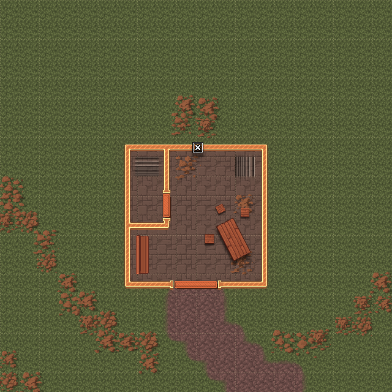
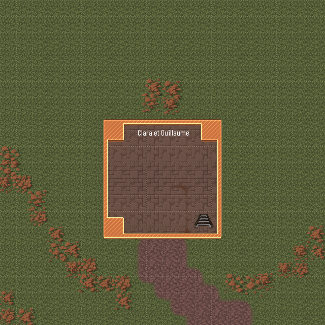

<div class='pageNumber auto'></div>

# La malédiction de la tour

Cette quête ne peut-être effectuée que de nuit.

Chaque nuit, des cris et des pleures peuvent se faire entendre depuis la tour de garde. Ces cris réveilleront les aventuriers. 

## Des traces de passage

En se dirigeant vers la tour de garde, les aventuriers repèreront des traces de passages.  
:warning: Ces traces n'apparaissent pas de jours.  


> #### Jet de caractéristique
> ___
> - **caractéristique:** Survie
> - **valeur:** 15
> ___
> - **succès:**  Ces traces correspondent à deux individus allongés dans l'herbe se dirigeant vers la tour.
> - **echec:** les herbes sont allongés, un défaut du terrain?

En suivant ces traces, les aventuriers se rapprocherons de la tour et verront deux adolescents allongés dans l'herbe, une fille et un garçon. Il ne semble pas remarquer les aventuriers.
- Tu es sure que ton plan va fonctionner Henri? demande la jeune fille.
- Ne t'en fait pas Clara, tu retrouveras très vite ton Guillaume.

A la suite de cet échange, les deux adolescent disparaissent comme ils étaient apparus.

> #### Jet de caractéristique
> ___
> - **caractéristique:** Histoire
> - **valeur:** 35
> - **spécial** Lecture des Comptes et légendes
> ___
> - **succès:**  Il y a bien un compte qui raconte l'histoire d'une jeune Clara qui transit d'amour convainquit Hanri le fils d'un fermier à l'aider à entrer dans une tour de garde. Il est raconté que les adolescents réussirent à entrer et que peu de temps après leur entrée, une attaque d'Orcs se fit sur la tour.  
> On ne les vit jamais en sortir.
> - **echec:** Des enfants fantomatiques ?! Rien de bon en général...

```
```

## le rez-de-chaussez



En arrivant à la tour, les aventuriers constateront qu'elle est en ruine. Personne ne garde plus cet endroit depuis longtemps. Il n'y a plus de porte, le bois rongé par les intempéries a laissé place à un trou béant.
En entrant dans la tour, les deux adolescents réapparaitront devant eux, se faufilant par un interstice dans le mur au fond de la pièce du rez-de-chaussée
- Viens Clara, personne en vue, tu peux passer.
Clara semble avoir du mal à garder sa robe entière, qui se déchire en passant dans l'anfractuosité.
- Henri, ma robe, ma si belle robe que va penser Guillaume?
- Il ne le verra pas, il ne verra que toi.
Les adolescent disparaissent à nouveau.

\page 
<div class='pageNumber auto'></div>

## le premier étage

  

Les restes d'une bataille sont encore visible, les lits sont éventrés comme si quelque chose de lourd s'était abattu sur eux, la table ne tient que sur trois pieds.

En arrivant dans la dernière chambre, les aventuriers auront une autre vision du passé.  
Des bruits de combat se font entendre ainsi qu'une lourde respiration d'agonie et la voix de Clara:
- Je suis navrée Henri, je ne peux pas restée là, il faut que je trouve Guillaume.
Clara se lève laissant Henri seul.
- Je te maudit Clara Fonteclaire, mon amour ne fut pas assez fort, mais puisse l'éternité d'errance te 
faire prendre conscience de ce que tu perds!
Henri toussera du sang et dans son dernier souffle :
- je t'aime tellement Clara...

```
```

## le toit de la tour



Clara est la pleurant sur le corps d'un jeune homme.
- Guillaume, *renifle*, je suis désolée, *renifle*...

En s'approchant, elle tient une dague. La vision n'est pas claire mais la dague semble bien suinter d'un liquide semblable à du sang.

Clara lève alors la dague qu'elle tient entre les mains et se transperce l'abdomen. Elle s'alonge sur Guillaume et dit:
- Puissions-nous être ensemble pour l'éternité.

La vision s'estompe et laisse place aux squelettes de deux personnes et une dague rouillée.

Après quelques seconde, une voix résonne derrière les aventuriers. Cette voix, c'est Clara:
- Voilà, vous savez tout. Pouvez-vous m'aider ?


> #### Jet de caractéristique
> ___
> - **caractéristique:** Sagess
> - **valeur:** 13
> ___
> - **succès:**  La créature qui se tiens devant les aventuriers n'est pas la Clara des visions, mais quelque chose de plus cauchemardesque. Les aventuriers sont devant une <a href="https://www.aidedd.org/dnd/monstres.php?vf=banshie">banshee</a>
> - **echec:** L'aventurier est pris d'une peur irrépressible

Deux choix s'offrent alors auw aventuriers:
- [Aider Clara](#aidee-une-defunte) à trouver la paix dans la mort.
- [Tuer Clara](#combattre-les-morts).

\page
<div class='pageNumber auto'></div>

### Aidée une défunte

Si les aventuriers décident de l'aider, Clara leur demandera de découvrir pourquoi elle est piègée ici depuis près de 100 ans. Clara racontera que depuis la nuit où elle s'est donnée la mort pour rejoindre son Guillaume, elle revient une fois tous les dix ans pour revivre cette nuit qui la laisse alors en pleures jusqu'au lendemain.

Les aventuriers devront raconter les évênements tel qu'ils les ont vus. et emmener Clara (du moins la Banshee) auprès de Henri. En voyant le squelette, elle le reconnaitra et il apparaitra:
- Henri je pensais que tu t'en était sorti
- Comment aurai-je pu?! Tu m'as laissé seul, je suis mort seul, dans cette chambre. Je t'aimais Clara mais tu préférais Guillaume. Aurait-il lui aussi tout fait pour que tu sois heureuse?
- Henri, tu ne m'as jamais rien dit comment auraisje pu deviner?
- Il te suffisait de regarder, qui était là pour toi? Qui te coonsolais lorsqu'il partait sans rien dire? Qui t'a emmener le rejoindre ici? Je ne demandais que ton amour!

Le jeune garçon se transforme alors en un nuage noir. Son visage se grime de trait de douleur et de haine.
[Henri](https://www.aidedd.org/dnd/monstres.php?vf=ame-en-peine) se jette alors sur le groupe.

### Combattre les morts

Si les aventuriers décident de ne pas aider Clara, elle prendra cela comme un affront et attaquera.

## Une scépulture

> #### Jet de caractéristique
> ___
> - **caractéristique:** Religion
> - **valeur:** 12
> ___
> - **succès:** Les aventuriers savent qu'ils doivent enterrer les ossements des adolescent. Reste à savoir où? 
> - **echec:** Il faut un prêtre qui connait les coutumes des anciens temps.

Les aventuriers devront donc creuser une scépulture pour Guilaume, Clara et Henri.  
Lorsque Clara sera enfin en terre, elle fera une dernière apparition pour remercier les aventuriers.

