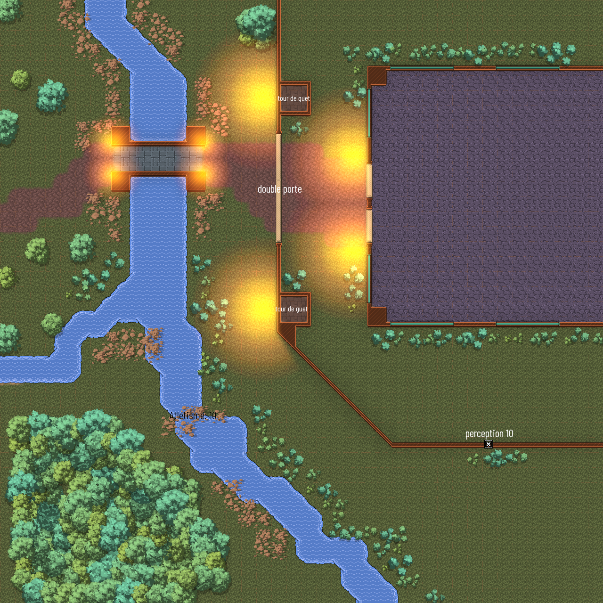

Cette quête est donnée via le [panneau](../3-Indices/images/panneau_conseil.png) présent 
devant la chambre du conseil.

# Introduction

Le mausolée du chêne tordu porte ce nom car il est situé proche d'un chêne centenaire 
dont le tronc forme la base d'un quatre.

```
    /
   /___
      /
	|
```

```
[jet de connaissance : histoire 15]
Le mausolée a été érigé lors de la découverte d'[Astoria](../1-Astoria/Astoria.md) par [Carolina Frei](../4-Personnages/carolina_frei.md).
Le mausolée contient les restes des corps retrouvé dans la cité avant qu'elle ne devienne 
la capitale de la principauté.
```

Le mausolée se situe sur une colline. Le chêne qui en est son symbole domine le lieux saint.


# Un fort improvisé

Les bandits n'ont pas chômé, ils ont établi une ligne de défense autour du mausolée. 

[Extérieur](images/Mausolee_chêne_tordu_ext.player.png)
<details> 
	<summary> Carte Maitre du jeu </summary>   
	  
</details>  

En arrivant, le premier point de passage reste [le pont de pierre](#par-le-pont) qui passe au-dessus d'une 
riviere et qui reste un endroit exposé aux tirs des arché posté sur les tours de garde improvisées. 


```
[jet de discretion: 10]
Les Bandits observent les alentours depuis leur tour de guet.
Tout joueur qui ne réussi pas le test provoquera une réaction d'un garde --> Qui va là?!
```

En suivant la rivière vers le sud, un [passage à guet](#passage-à-guet) est disponible.


## Par le pont

Le courrant dans la rivère est trop important pour essayer de passer à la nage.
Le pont est un lieu qui reste très exposé. Aucun jet de discrétion ne peut permettre de passer sans être vu. 
Seul l'[invisibilité](https://www.aidedd.org/dnd/sorts.php?vf=invisibilite) permet de passer sans déclancher 
l'alerte.

Si un aventurier décide de passer (sans invisibilite) alors les bandits attaqueront sans cri de semonces.
Le combat débutera alors.

<details> 
	<summary> Détail pour le MJ </summary>   
	<p> Etant en surplomb, les bandits attaque avec aventage. < /br> Les aventuriers quant à eux attaquent 
	avec désavantage: ils sont en contrebas.</p>
	<p> Les aventurier font face à 4 [Malfrats](https://www.aidedd.org/dnd/monstres.php?vf=malfrat) à 
	l'arbalète lourde. </p>
</details> 

Lorsque les bandits seront morts, les aventuriers pourront passer le pont. Devant eux se dressent une double 
porte improvisée. 
```
[jet de force: 15]
Après quelques coups de bélier, la porte cède. L'un des pans tombent au sol, lorsque la barricade se brise.
```


## Passage à guet

En suivant la rivère par le sud, les aventuriers constateront qu'elle se séparre en deux bras. Le premier 
se dirige vers l'ouest, le second continue sont chemin vers le sud-ouest. Le premier bras se transforme 
en ruisseau, se qui facilite le passage. Le second bras reste tumultueux ce qui empèche toute traversée 
dans l'eau. 
Des rochers disposés dans le lit de la rivière forment un passage qui nécessite un peu d'équilibre pour passer.  

En s'assurant avec une corde, les aventuriers obtiennent un avantage au jet qui suit.

```
[jet d'Atlhétisme: 10]
La rivière reste agitée et provoque une chute dans l'eau (1d6 dégat).
``` 

Une fois de l'autre coté, les aventuriers pourront passer le long de la muraille.
```
[jet de perception: 10]
Un trou dans la muraille permet d'entrer dans les fortifications.
```

Si les aventuriers ne détectent pas le trou dans la muraille, ils pourront remonter vers le chêne tordu. 
```
[jet de discretion: 10]
Bien que soous la ligne de vue, passer à proximité des tours de garde et surtout le long de la porte peut 
éveiller les soupçons.
```

La forme du chêne créé un passage au dessus de la muraille.
```
[jet d'Athletisme: 10]
Grimper n'est pas si facile bien que la forme de l'arbre donne des prises faciles.
En cas d'echec, l'aventurier subit 1d4 de dégat.
```  

A l'intérieur de la muraille, les aventuriers devront une dernière fois être discret, afin de ne pas attirer 
les regards des sentinelles (si elle ne sont pas mortes).

# Dans le mausolée

[carte](images/Mausolee_chêne_tordu_int.png)

En entrant dans le mausolée, les aventuriers seront face à deux énormes statues de rois nordique. Le sol et les 
murs sont fait de marbre blanc. Quatre passage s'offrent aux aventuriers:
- deux longes les mur du mausolée
- deux passent au centre du mausolée.

Au fond du mausolée, des voix se font entendre. 
- Le maitre commence à s'impatienter...vous etes sensé être les meilleurs. Ouvrez les sous-terrains ou vous 
servirez le maitre à jamais!
*le crépitement d'une ennergie magique se fait sentir, puis plus un bruit*
- Va te faire foutre! cri une autre voix. Bien vous autre, au travail!


Le groupe est composé de :
- 1 [Illusioniste](https://www.aidedd.org/dnd/monstres.php?vf=illusionniste)
- 1 [Veteran](https://www.aidedd.org/dnd/monstres.php?vf=veteran)
- 2 [Malfrats](https://www.aidedd.org/dnd/monstres.php?vf=malfrat)

A l'issue du combat, les aventuriers pourront fouiller les cadavres et trouveront:
- un contrat, signé avec ce qui ressemble à du sang. Les termes du contrat commence à s'effacer. Ce que l'aventurier 
arrive à déchiffrer est: "...echange ma vie...richesse et gloire"
- un journal sur l'invocateur qui retrace les évènements depuis leur arrivée, la construction du fortain, la recherche 
dans le mausolé, le déchiffrement des terme écrit sur les chérubins: 
```
    - au nord, il est ecrit "centre".
	- au sud , il est écrit "révèle".
	- à l'est, il est écrit "assemblé" mais ici j'ai un doute, mon nain antique est un peu rouillé.
	- à l'ouest, il est écrit "regard".
```
- un  total de 259po et 600po de gèmme précieuse et semi-précieuse.